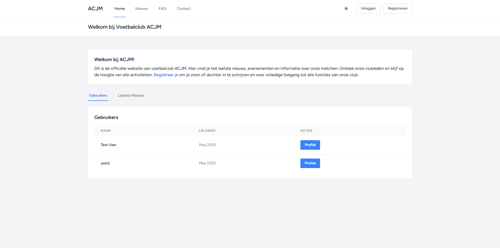

# ACJM Voetbalclub - Website Management Platform

Een dynamische website gebouwd met Laravel voor de Backend Web eindopdracht. ACJM is een platform voor voetbalclub ACJM waar bezoekers nieuws kunnen lezen, FAQ's kunnen raadplegen, contact kunnen opnemen, en hun kinderen kunnen inschrijven voor voetbaltraining.

## Functionaliteiten

### Authenticatie & Gebruikersbeheer
- Gebruikersregistratie en login systeem
- Admin en gewone gebruiker rollen
- Admin dashboard voor gebruikersbeheer
- Mogelijkheid voor admins om andere gebruikers admin rechten te geven/afnemen
- Standaard admin account ingebouwd
- Wachtwoord vergeten functionaliteit

### Profielsysteem
- Publieke profielpagina's voor alle gebruikers
- Persoonlijke profielinstellingen (username, verjaardag, telefoon, over mij)
- Klikbare gebruikersnamen door de hele applicatie
- Display name functionaliteit

### Nieuws Systeem
- Nieuws CRUD functionaliteit voor admins
- Publieke nieuwsweergave voor alle bezoekers
- Afbeelding upload en management
- Auteur informatie met klikbare profielen
- Publicatie datum en status beheer

### FAQ Systeem
- Categorieën en vragen beheer voor admins
- Uitklapbare FAQ weergave met moderne UI
- Georganiseerd per categorie
- Sorteer volgorde voor categorieën

### Contact Systeem
- Contact formulier voor alle bezoekers
- Berichten management voor admins
- Gelezen/ongelezen status voor berichten
- Admin kan berichten markeren als gelezen of verwijderen

### Inschrijvingen Systeem
- **Kinderinschrijvingen**: Ouders kunnen hun kinderen inschrijven voor voetbaltraining
- **Formulier velden**: Naam kind, leeftijd (4-18 jaar), naam ouders, e-mail, telefoon (optioneel), t-shirt maat, schoenmaat
- **Admin beheer**: Admins kunnen alle inschrijvingen bekijken, status wijzigen (pending/approved/rejected), en inschrijvingen verwijderen
- **E-mail integratie**: Directe e-mail links naar ouders vanuit admin panel
- **Status tracking**: Inschrijvingen hebben verschillende statussen met kleurgecodeerde badges

### Footer Systeem
- Professionele footer op alle pagina's
- Club informatie en contact gegevens
- Snelle navigatie links
- "Alle rechten voorbehouden" voor ACJM met dynamisch jaar

## Screenshots

### Welcome Pagina
De welkomstpagina toont de hoofdfunctionaliteiten van ACJM voetbalclub met een overzicht van gebruikers en recent nieuws.



### Inschrijvingen Systeem
Het inschrijvingsformulier waar ouders hun kinderen kunnen aanmelden voor voetbaltraining bij ACJM.


## Technische Implementatie

### Models & Database Relaties
- **User Model** (`app/Models/User.php`) - Gebruikersbeheer met rollen
- **News Model** (`app/Models/News.php`) - Nieuws artikel beheer  
- **FaqCategory Model** (`app/Models/FaqCategory.php`) - FAQ categorieën
- **Faq Model** (`app/Models/Faq.php`) - FAQ vragen en antwoorden
- **ContactMessage Model** (`app/Models/ContactMessage.php`) - Contact berichten
- **ChildRegistration Model** (`app/Models/ChildRegistration.php`) - Kinderinschrijvingen
- **UserProfile Model** (`app/Models/UserProfile.php`) - Uitgebreide profielinformatie

#### Database Relaties:
- **One-to-Many**: User → News, FaqCategory → Faq
- **One-to-One**: User → UserProfile

### Controllers
- **Admin\UserController** (`app/Http/Controllers/Admin/UserController.php`) - Gebruikersbeheer met veiligheidsmaatregelen
- **Admin\NewsController** (`app/Http/Controllers/Admin/NewsController.php`) - Nieuws CRUD operaties
- **Admin\FaqCategoryController** (`app/Http/Controllers/Admin/FaqCategoryController.php`) - FAQ categorieën beheer
- **Admin\FaqController** (`app/Http/Controllers/Admin/FaqController.php`) - FAQ vragen beheer
- **Admin\ContactController** (`app/Http/Controllers/Admin/ContactController.php`) - Contact berichten beheer
- **Admin\AdminRegistrationController** (`app/Http/Controllers/Admin/AdminRegistrationController.php`) - Inschrijvingen beheer
- **RegistrationController** (`app/Http/Controllers/RegistrationController.php`) - Publieke inschrijvingen
- **NewsController** (`app/Http/Controllers/NewsController.php`) - Publieke nieuws weergave
- **ContactController** (`app/Http/Controllers/ContactController.php`) - Contact formulier handling
- **UserProfileController** (`app/Http/Controllers/UserProfileController.php`) - Profiel management

### Views & Layout
- **Layouts**: `app-layout` voor ingelogde gebruikers, `guest-layout` voor login/register pagina's
- **Components**: Footer component voor consistente weergave
- **Admin Views**: Aparte admin templates voor inschrijvingen beheer
- **XSS Protection**: Alle user input wordt geëscaped via Laravel Blade
- **CSRF Protection**: Standaard Laravel CSRF tokens op alle formulieren

### Routes & Middleware
Alle routes zijn georganiseerd in groepen met appropriate middleware:
- **Public routes**: Nieuws, FAQ, Contact, Inschrijvingen (geen authenticatie vereist)
- **Auth routes**: Dashboard, Profiel (authenticatie vereist)
- **Admin routes**: Admin panel, inschrijvingen beheer (authenticatie + admin rol vereist)

## Project Structuur

```
Project-Backend-Web/
├── app/
│   ├── Http/
│   │   ├── Controllers/
│   │   │   ├── Admin/               # Admin controllers
│   │   │   ├── ContactController.php
│   │   │   ├── NewsController.php
│   │   │   ├── FaqController.php
│   │   │   ├── RegistrationController.php
│   │   │   └── UserProfileController.php
│   │   ├── Middleware/              # AdminMiddleware
│   │   └── Requests/                # ChildRegistrationRequest
│   └── Models/                      # Eloquent models
├── database/
│   ├── migrations/                  # Database schema's inclusief child_registrations
│   └── seeders/                     # Test data generators
├── public/                          # Publieke bestanden
├── resources/
│   └── views/
│       ├── admin/
│       │   ├── registrations/       # Admin inschrijvingen beheer
│       │   ├── contact/             # Admin contactbeheer
│       │   ├── news/                # Admin nieuws beheer
│       │   └── faqs/                # Admin FAQ beheer
│       ├── registrations/           # Publieke inschrijvingen
│       ├── contact/                 # Contact formulieren
│       ├── faq/                     # FAQ pagina's
│       ├── news/                    # Nieuws overzicht en details
│       ├── profiles/                # Gebruikersprofielen
│       ├── components/              # Footer component
│       └── layouts/                 # Template layouts
├── routes/
│   └── web.php                      # Web routes
├── screenshots/                     # Screenshots van de applicatie
└── storage/                         # Bestanden, logs, cache
```

## Installatie

### Vereisten
- PHP >= 8.2
- Composer
- MySQL/MariaDB
- Node.js & NPM

### Installatiestappen

1. **Clone de repository**
```bash
git clone [repository-url]
cd Project-Backend-Web
```

2. **Installeer dependencies**
```bash
composer install
npm install
```

3. **Environment configuratie**
```bash
cp .env.example .env
php artisan key:generate
```

4. **Database configuratie**
Pas je `.env` bestand aan met je database gegevens:
```env
DB_CONNECTION=mysql
DB_HOST=127.0.0.1
DB_PORT=3306
DB_DATABASE=acjm_voetbalclub
DB_USERNAME=(invullen)
DB_PASSWORD=(invullen)
```

5. **Database setup**
```bash
php artisan migrate:fresh --seed
```

6. **Storage link**
```bash
php artisan storage:link
```

7. **Build assets**
```bash
npm run dev
```

8. **Start de applicatie**
```bash
php artisan serve
```

Bezoek `http://localhost:8000` om de applicatie te bekijken.

## Standaard Admin Account

Na het uitvoeren van de seeders is er een standaard admin account beschikbaar:

- **Email**: admin@ehb.be
- **Password**: Password!321
- **Rol**: Administrator

## Technische Vereisten Implementatie

| Vereiste | Implementatie Locatie | Beschrijving |
|----------|----------------------|--------------|
| **Views - Layouts** | `resources/views/layouts/` | App-layout en guest-layout |
| **Views - Components** | `resources/views/components/` | Footer component |
| **XSS Protection** | Alle `.blade.php` files | Laravel Blade auto-escaping |
| **CSRF Protection** | Alle formulieren | `@csrf` directive |
| **Route Middleware** | `routes/web.php` | Auth en admin middleware groepen |
| **Resource Controllers** | `app/Http/Controllers/Admin/` | Admin controllers voor CRUD operaties |
| **One-to-Many** | `app/Models/User.php` | User → News relatie |
| **One-to-One** | `app/Models/User.php` | User → UserProfile relatie |
| **Migrations** | `database/migrations/` | Alle database schema's inclusief child_registrations |
| **Seeders** | `database/seeders/` | Admin user seeder |

## Extra Features

- **Kinderinschrijvingen Systeem**: Volledig beheer van voetbal inschrijvingen
- **E-mail Integratie**: Directe e-mail links naar ouders vanuit admin panel
- **Status Management**: Inschrijvingen kunnen goedgekeurd, afgewezen of in behandeling zijn
- **Professional Footer**: Consistente footer op alle pagina's met clubinformatie
- **Dark Mode Support**: Volledige dark/light mode ondersteuning
- **Responsive Design**: Werkt op alle apparaten
- **Admin Beveiligingen**: Admins kunnen hun eigen rechten niet per ongeluk verwijderen
- **Form Validation**: Uitgebreide validatie voor alle formulieren
- **User Profiles**: Uitgebreide profielinformatie met birthday tracking

## Gebruikte Technologieën

- **Backend**: Laravel 11, PHP 8.2
- **Frontend**: Blade Templates, Tailwind CSS, Alpine.js
- **Database**: MySQL met Eloquent ORM
- **Authentication**: Laravel Breeze
- **File Storage**: Laravel Storage met public disk
- **Styling**: Tailwind CSS met voetbal-geïnspireerde kleuren

## Gebruikte Bronnen

- [Laravel Documentation](https://laravel.com/docs)
- [Tailwind CSS Documentation](https://tailwindcss.com/docs)
- [Laravel Breeze](https://laravel.com/docs/starter-kits#laravel-breeze)
- [Alpine.js Documentation](https://alpinejs.dev/)
- AI Assistants:
  - GitHub Copilot voor code suggestions, vragen en autocompletion tijdens development

## Auteur

**Naam**: Yazid El Yazghi  
**Vak**: Backend Web  
**Academiejaar**: 2024-2025  
**Hogeschool**: Erasmushogeschool Brussel

---

*ACJM Voetbalclub - Samen sporten, samen groeien* ⚽
